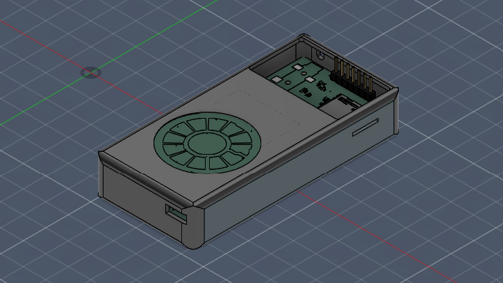
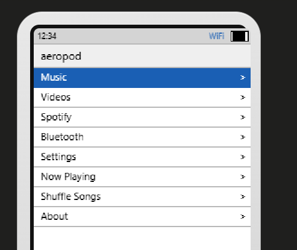
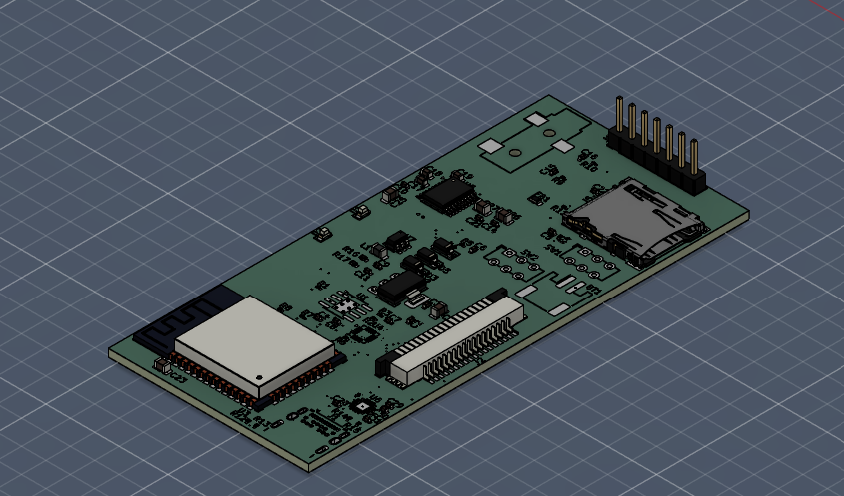
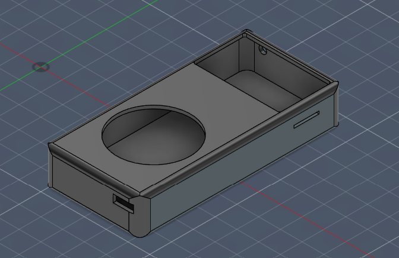

# aeropod

**A handheld music player built from scratch: custom hardware, custom firmware, custom everything.**

aeropod is an iPod-inspired portable media player built around an ESP32. It has a
capacitive click wheel, a 240×320 colour display, and plays music three different
ways: local files from a microSD card, **Spotify** (both as a Spotify Connect
speaker *and* through the Web API), and as a **Bluetooth speaker** over A2DP. It
even plays MJPEG video. Everything runs on a custom 4-layer circuit board I
designed, inside a 3D-printed case.

<!-- PHOTO: hero shot of the finished aeropod in your hand. Drop the file in docs/images/ and update the path below. -->


---

## What it does

- **Local playback**: MP3 / AAC / WAV streamed off a microSD card, browsed by Artist → Album → Track
- **Spotify**: log in once on your phone, then control playback and stream straight to the device. aeropod also announces itself as a **Spotify Connect** target, so you can pick it as a speaker from the Spotify app
- **Bluetooth audio** works both ways: use aeropod as a Bluetooth *speaker* (A2DP sink) from your phone, or have it stream *out* to Bluetooth headphones (A2DP source). AVRCP play/pause/skip supported in both directions
- **Video**: software MJPEG decoding at 240×320, ~10-15 fps, with a synced PCM audio track
- **Click wheel**: a real capacitive touch wheel (MPR121) on its own daughterboard, plus five mechanical buttons, just like the classic
- **iPod-style UI**: stack-based screen system, scrolling menus, now-playing view, a status bar with battery and clock, redrawn at ~33 fps

<!-- PHOTO: the UI on the screen, main menu or now-playing. -->


---

## Hardware

aeropod is two custom PCBs plus a 3D-printed enclosure.

| Subsystem | Part | Notes |
|-----------|------|-------|
| MCU | **ESP32-WROOM-32** | dual-core, Wi-Fi + Classic Bluetooth |
| Display | **ST7789** 240×320 SPI IPS LCD | PWM backlight |
| Audio DAC | **PCM5102A** | 32-bit I²S stereo DAC |
| Touch input | **MPR121** | 12-zone capacitive click wheel |
| Buttons | 5× tactile | Menu / Prev / Next / Play / Center |
| Storage | microSD (SPI) | FAT, holds the music library |
| Power | USB-C → **TP4056** charger → LiPo → **AMS1117-3.3V** + **MT3608** boost | |

**Main board**: 4-layer, ~41 × 90 mm, 67 components, 147 vias.
**Click wheel board**: the rounded daughterboard that carries the capacitive ring and buttons.

### Pin map

| Peripheral | Pins |
|------------|------|
| ST7789 display | SCK 18, MOSI 23, CS 5, DC 17, RST 16, BL 27 |
| microSD (shared SPI bus) | CS 15 |
| PCM5102A I²S | BCK 26, LRCK 25, DATA 22 |
| MPR121 click wheel (I²C) | SDA 21, SCL 4, IRQ 13 |
| Buttons | MENU 34, PREV 35, NEXT 32, PLAY 33, CENTER 39 |

<!-- PHOTO: the bare PCB(s), and/or the board with components soldered. -->


<!-- PHOTO: the 3D-printed case, printed parts and/or final assembly. -->


---

## How the firmware works

The firmware is written in C on **ESP-IDF v5.2+**, about 7,300 lines across a dozen
modules. It's organised so each subsystem (audio, video, Spotify, Bluetooth,
storage, UI) is self-contained.

**Boot sequence:** NVS → display + splash → click-wheel/buttons → SD mount + library
scan → audio player → video player → Wi-Fi → Spotify → Bluetooth → UI.

**Task / core layout:**

| Core | Task | Job |
|------|------|-----|
| 0 | `ui_task` | 33 fps render + input dispatch |
| 0 | `mpr_ring` | MPR121 click-wheel IRQ processing |
| 0 | `cw_btn` | mechanical button polling |
| 1 | `player_task` | MP3 decode (minimp3) + I²S output |
| 0 | `http_fetch` | HTTP audio stream fetch |
| 0 | `sp_connect` | Spotify Connect mDNS + polling |

**Spotify** uses OAuth 2.0 PKCE device-code login (you authorise on your phone, tokens
are saved to NVS and auto-refresh), the Spotify Web API over HTTPS for browse/search/
playback control, and a Spotify Connect receiver that announces over mDNS and decodes
the audio stream to the I²S DAC.

**Bluetooth** uses the ESP32's Classic BT (BR/EDR) stack with A2DP for audio and AVRCP
for transport controls, running alongside Wi-Fi via software coexistence.

---

## Repository layout

```
aeropod/
├── aeropod_firmware/        ESP-IDF firmware (C)
│   ├── main/
│   │   ├── audio/           I²S output + MP3/AAC/WAV player
│   │   ├── bt_audio/        Bluetooth A2DP sink/source + AVRCP
│   │   ├── drivers/         display (ST7789), click wheel (MPR121), fonts
│   │   ├── network/         Wi-Fi manager + HTTP streaming
│   │   ├── spotify/         OAuth PKCE, Web API, Spotify Connect
│   │   ├── storage/         microSD + in-memory media library
│   │   ├── ui/              screen stack + screens (menus, now-playing...)
│   │   ├── video/           MJPEG player (TJpgDec)
│   │   ├── config.h         all hardware pin assignments
│   │   └── main.c           boot + app_main
│   └── BUILD.md             full build instructions
├── aeropod2/                main board - KiCad 10 project + 3D model
├── clickwheel/              click-wheel board - KiCad 10 project + 3D model
└── aeropod case (Assembly).step   3D-printed enclosure
```

---

## Building the firmware

Full instructions are in [`aeropod_firmware/BUILD.md`](aeropod_firmware/BUILD.md). Short version:

```bash
# Requires ESP-IDF v5.2+ and an ESP32
. $IDF_PATH/export.sh

cd aeropod_firmware
idf.py set-target esp32
idf.py build
idf.py -p /dev/ttyUSB0 flash monitor   # COMx on Windows
```

Two third-party decoders are downloaded during setup rather than committed here
(see BUILD.md): **minimp3** (MP3) and **TJpgDec** (JPEG/video). For Spotify, register a
free app at the Spotify developer dashboard and drop your Client ID into `config.h`
(or enter it at runtime in Settings).

---
